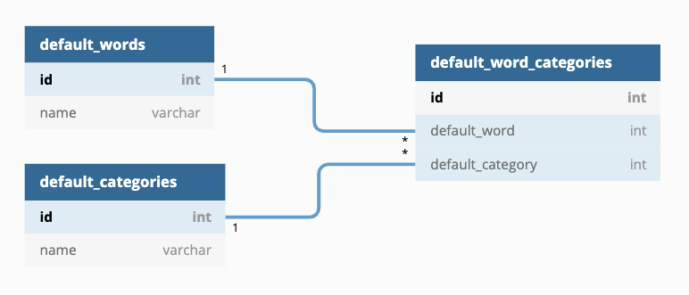
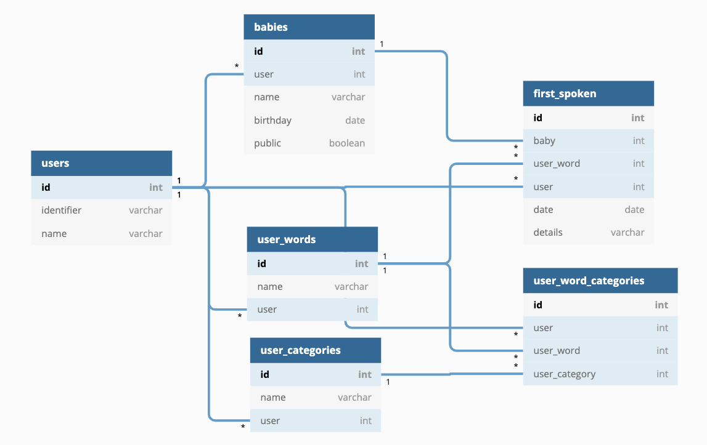

Motivation for project
Project dependencies, local development and hosting instructions,
Detailed instructions for scripts to install any project dependencies, and to run the development server.
Documentation of API behavior and RBAC controls

# BabyWords
## 1. Description
BabyWords is an API for tracking first words spoken by a baby. Common first words and word categories are pre-populated from a default database when a new user signs up for the first time. Thereafter, users may create, update, and delete words and categories to fit thier needs. Users may register multiple babies. The API has a "timeline" feature which lists words spoken by their dates - users may choose to publicly share this timeline endpoint. All other endpoints will be private. Admins have access to the default word and category databases used to populate defaults for new users. 

## 2. Getting Started
### 2.1 Dependencies
Developers using this project should already have Python3 and pip installed on their local machines.
Run the following to install required pacakges:
```
pip install requirements.txt
```

### 2.2 Database Setup
With Postgres running, create a database (sample below refers to a database named "BabyWords") and populate the database using the BabyWords_Test.psql file provided. 
From terminal run:
```
psql BabyWords < BabyWords_Test.psql
```
Edit the setup.sh file to provide your own database name, username and password (if any).
From terminal run the following to supply the environmental variables to the API:
```
source setup.sh
```

### 2.3 Auth0 Setup
The project is configured to work with Auth0 to manage Role-based access control.
See [Auth 0 Documentation](https://auth0.com/docs/) to obtain your own tenant domain and set up your own application.

Your own configurations need to be in place in auth.py. Secrets should be stored in setup.sh. You will need, minimally, one token from each role detailed below to run the tests.

There are two roles, each with one permission, defined in this project.
#### Role 1: Admin - Permissions: "crud:default_values"
An Admin may perform CRUD operations on default categories and default words through the API. They may not access user data.
#### Role 2: User - Permissions: "crud:own_data"
A User may perform CRUD operations on data that is associated with their own Auth0 identifier. 


### 2.4 Starting the API server

Run the following to start the API server:
```
python3 app.py
```
The application is run on http://0.0.0.0:8080/ by default 

## 3. Heroku
The API is hosted live via [https://babywords.herokuapp.com/](https://babywords.herokuapp.com/).

This is a public endpoint you may visit without a JWT token:
https://babywords.herokuapp.com/baby/1/timeline/public

All other endpoints will require a Bearer token. You may find sample tokens in setup.sh 


## 4. Tests
Run the following commands, skipping the dropdb line if running for the first time:
```
dropdb BabyWords_Test 
createdb BabyWords_Test
psql BabyWords_Test < BabyWords_Test.psql
python test_app.py
```

## 5. Database Diagram
All tables reside in the same database.
This diagram shows the relationships between the default tables:


This diagram shows the relationships between the user tables:



## 6. API Reference
### GET /user
- Fetches user id and name
- Sample Request
```
curl http://0.0.0.0:8080/user -H "Content-Type: application/json" \
-H "Authorization: Bearer ${userToken}"
```
- Sample Response:
```
{
  "success": true, 
  "user": {
    "id": 1, 
    "name": "Aileen"
  }
}
```

### PATCH /user
- Edits user name
- Sample Request
```
curl http://0.0.0.0:8080/user -X PATCH -H "Content-Type: application/json" \
-H "Authorization: Bearer ${userToken}" \
-d '{
  "name":"Ivy"
}'
```
- Sample Response:
```
{
  "success": true, 
  "user": {
    "id": 1, 
    "name": "Ivy"
  }
}
```

### GET /babies
- Fetches a list of the user's babies and the babies' information
- Sample Request
```
curl http://0.0.0.0:8080/babies -H "Content-Type: application/json" \
-H "Authorization: Bearer ${userToken}"
```
- Sample Response:
```
{
  "babies": [
    {
      "birthday": "Fri, 30 Oct 2020 00:00:00 GMT",
      "id": 1,
      "name": "Benjamin",
      "public": true
    },
    {
      "birthday": "Sun, 04 Jun 2017 00:00:00 GMT",
      "id": 2,
      "name": "Elizabeth",
      "public": false
    },
  ],
  "success": true
}
```

### POST /babies
- Adds a baby to the user
- Sample Request
```
curl http://0.0.0.0:8080/babies -X POST -H "Content-Type: application/json" \
-H "Authorization: Bearer ${userToken}" \
-d '{
	"name":"Olivia",
	"birthday":"2020-10-12"
}'
```
- Sample Response
```
{
  "baby_id": 3,
  "success": true
}
```

### PATCH /baby/\<int:baby_id\>
- Edits a baby's name, birthday, and whether to enable the public viewing option of the baby's timeline view
- Sample Request
```
curl http://0.0.0.0:8080/baby/2 -X PATCH -H "Content-Type: application/json" \
-H "Authorization: Bearer ${userToken}" \
-d '{
	"name":"Izabet",
	"birthday":"2017-10-12",
  "public": true
}'
```
- Sample Response
```
{
  "edited_baby_id": 3, 
  "success": true
}
```

### GET /categories
- Fetches a list of the user's word categories
- Sample Request
```
curl http://0.0.0.0:8080/categories -H "Content-Type: application/json" \
-H "Authorization: Bearer ${userToken}"
```
- Sample Response
```
{
  "categories": [
    {
      "id": 1, 
      "name": "Fruits"
    }, 
    {
      "id": 2, 
      "name": "Red Fruit"
    }
  ], 
  "success": true
}
```

### GET /category/\<int:category_id\>
- Fetches a list of word objects associated with the category
- Sample Request
```
curl http://0.0.0.0:8080/category/1 -H "Content-Type: application/json" \
-H "Authorization: Bearer ${userToken}"
```
- Sample Response
```
{
  "category": 1, 
  "success": true, 
  "words": [
    {
      "id": 1, 
      "name": "Banana"
    },
    {
      "id": 2, 
      "name": "Apple"
    }
  ]
}
```

### GET /category/\<int:category_id\>/baby/\<int:baby_id\>
- Fetches a list of words in the category that have been spoken by the specified baby
- Sample Request
```
curl http://0.0.0.0:8080/category/1/baby2 -H "Content-Type: application/json" \
-H "Authorization: Bearer ${userToken}"
```
- Sample Response
{
  "babywords": [
    {
      "baby_id": 2, 
      "baby_name": "Elizabeth", 
      "date": "Sun, 01 Mar 2020 00:00:00 GMT", 
      "details": null, 
      "id": 4, 
      "word": "Banana", 
      "word_id": 1
    }
  ], 
  "category": 1, 
  "success": true
}

### GET /word/\<int:word_id\>
- Fetches the word, dates first spoken by all babies, and any details
- Sample Request
```
curl http://0.0.0.0:8080/word/16 -H "Content-Type: application/json" \
-H "Authorization: Bearer ${userToken}"
```
- Sample Response
```
{
   "first_spoken": [
       {
           "baby_id": 2,
           "baby_name": "Elizabeth",
           "date": "Fri, 10 Apr 2020 00:00:00 GMT",
           "details": null,
           "id": 20,
           "word": "Tomato",
           "word_id": 16
       }
   ],
   "success": true,
   "word": {
       "id": 16,
       "name": "Tomato"
   }
}
```

### GET /baby/\<int:baby_id\>/timeline
- Fetches all of the specified baby's spoken words so far in a chronological order
- Sample Request
```
curl http://0.0.0.0:8080/baby/2/timeline -H "Content-Type: application/json" \
-H "Authorization: Bearer ${userToken}"
```
- Sample Response
```
{
  "first_spoken_words": [
    {
      "baby_id": 2, 
      "baby_name": "Elizabeth", 
      "date": "Sun, 01 Mar 2020 00:00:00 GMT", 
      "details": null, 
      "id": 4, 
      "word": "Banana", 
      "word_id": 1
    }, 
    {
      "baby_id": 2, 
      "baby_name": "Elizabeth", 
      "date": "Sun, 01 Mar 2020 00:00:00 GMT", 
      "details": null, 
      "id": 5, 
      "word": "Apple", 
      "word_id": 2
    }, 
    {
      "baby_id": 2, 
      "baby_name": "Elizabeth", 
      "date": "Sat, 28 Mar 2020 00:00:00 GMT", 
      "details": "used sign too!", 
      "id": 6, 
      "word": "Pineapple", 
      "word_id": 3
    }
  ], 
  "success": true
}
```

### GET /baby/\<int:baby_id\>/timeline/public
- Identical to the endpoint above, except that authorization is not required
- Sample Request
```
curl http://0.0.0.0:8080/baby/2/timeline -H "Content-Type: application/json"
```
- Response is identical to above

### POST/categories
- Adds a new category
- Sample Request
```
curl http://0.0.0.0:8080/categories -X POST -H "Content-Type: application/json" \
-H "Authorization: Bearer ${userToken}" \
-d '{
	"name":"Blue Fruit",
}'
```
- Sample Response
```
{
	"success": true
	"created_category_id": 6
}
```

### POST /words
- Adds a new word
- Sample Request
```
curl http://0.0.0.0:8080/words -X POST -H "Content-Type: application/json" \
-H "Authorization: Bearer ${userToken}" \
-d '{
  "name":"Dragon Fruit",
  "categories":[1,6]
}'
```
- Sample Response
```
{
  "created_word_category_ids": [
    15, 
    16
  ], 
  "created_word_id": 12, 
  "success": true
}
```


### POST /first_spoken_words
- Adds a record for a word being spoken by a baby for the first time
- Sample Request
```
curl http://0.0.0.0:8080/first_spoken_words -X POST -H "Content-Type: application/json" \
-H "Authorization: Bearer ${userToken}" \
-d '{ 
	"baby_id":2,
  "word_id":3,
  "date":"2021-03-28",
  "details":"used sign too!"
}'
```
- Sample Response
```
{
  "created_first_spoken_word_id": 6, 
  "success": true
}
```

### PATCH /category/\<int:category_id\>
- Edit category name
- Sample Request
```
curl http://0.0.0.0:8080/category/2 -X PATCH -H "Content-Type: application/json" \
-H "Authorization: Bearer ${userToken}" \
-d '{
  "name":"Spiky Fruits"
}'
```
- Sample Response
```
{
  "edited_category_id": 2, 
  "success": true
}
```

### PATCH /word/\<int:word_id\>
- Edit word name and categories
- Sample Request
```
curl http://0.0.0.0:8080/word/10 -X PATCH -H "Content-Type: application/json" \
-H "Authorization: Bearer ${userToken}" \
-d '{
  "name":"Dragonfruit",
  "categories":[1, 2]
}'
```
- Sample Response
```
{
  "edited_category_ids": [
    1, 2
  ], 
  "edited_word_id": 10, 
  "success": true
}
```

### PATCH /first_spoken_word/\<int:first_spoken_word_id\>
- Edits date spoken, details, and baby to which the entry belongs.
- Sample Request
```
curl http://0.0.0.0:8080/first_spoken_word/20 -X PATCH -H "Content-Type: application/json" \
-H "Authorization: Bearer ${userToken}" \
-d '{
  "date": "2020-12-25",
  "baby_id": 3,
  "details": "loves tomatoes!!"
}'
```
- Sample Response
```
{
    "edited_first_spoken_word_id": 20,
    "success": true
}
```

### DELETE /category/\<int:category_id\>
- Removes a category. Rows in the table "user_word_categories" that include this category will also be removed. Words originally associated with the category will NOT be removed.
- Sample Request
```
curl http://0.0.0.0:8080/category/2 -X DELETE -H "Content-Type: application/json" \
-H "Authorization: Bearer ${userToken}"
```
- Sample Response
```
{
	"success": True,
  "deleted_category_id": 2
}
```

### DELETE /word/\<int:word_id\>
- Removes a word. Rows in the tables "user_word_categories" and "first_spoken_words" that include this word will also be removed. 
- Sample Request
```
curl http://0.0.0.0:8080/word/9 -X DELETE -H "Content-Type: application/json" \
-H "Authorization: Bearer ${userToken}"
```
- Sample Response
```
{
	"success": True,
  "deleted_word_id": 9
}
```

### DELETE /first_spoken_word/\<int:first_spoken_word_id\>
- Removes the record of the word being spoken and the date.
- Sample Request
```
curl http://0.0.0.0:8080/first_spoken_word/20 -X DELETE -H "Content-Type: application/json" \
-H "Authorization: Bearer ${userToken}"
```
- Sample Response
```
{
	"success": True,
  "deleted_first_spoken_word_id": 20
}
```

### GET /login_landing
- This is the endpoint where Auth0 sends the user after successful log-in.
- If the user already exists in the database, it returns a sucess value and redirect message.
- If the user is new, a "populate_defaults" function will run, copying words, categories, and word-category relationships for the new user. It will then return the newly created user id.
- Sample Request
```
curl http://0.0.0.0:8080/login_landing -X GET -H "Content-Type: application/json" \
-H "Authorization: Bearer ${userToken}"
```
- Sample Response for existing user
```
{
	"success": True,
  "redirect": "you are logged in!"
}
```
- Sample Response for new user
```
{
	"success": True,
  "created_user_id": 8
}
```

### GET /view_defaults
- Fetches all categories, and words associated with each category
- Sample Request
```
curl http://0.0.0.0:8080/view_defaults -X GET -H "Content-Type: application/json" \
-H "Authorization: Bearer ${adminToken}"
```
- Sample Response
```
{
  "success": true,
  "categories": [
    {
      "id": 1,
      "name": "Fruits"
    },
    {
      "id": 2,
      "name": "Colors"
    }
   ],
   "words": {
      "Colors": [
        {
          "id": 1,
          "name": "Orange"
        }
      ],
      "Fruits": [
        {
          "id": 1,
          "name": "Orange"
        },
        {
          "id": 2,
          "name": "Watermelon"
        }
      ]
   }
}
```

### POST /default_categories
- Adds a default category
- Sample Request
```
curl http://0.0.0.0:8080/default_categories -X POST -H "Content-Type: application/json" \
-H "Authorization: Bearer ${adminToken}" \
-d '{ 
	"name":"weather"
}'
```
- Sample Response
```
{
	success: true
	created_category_id: 9
}
```

### POST /default_words
- Adds a default word
- Sample Request
```
curl http://0.0.0.0:8080/default_words -X POST -H "Content-Type: application/json" \
-H "Authorization: Bearer ${adminToken}" \
-d '{ 
  "name":"Strawberry",
  "categories": [1, 3]
}'
```
- Sample Response
```
{
   "created_word_category_ids": [
       4,
       5
   ],
   "created_word_id": 3,
   "success": true
}
```

### DELETE /default_category/\<int:category_id\>
- Removes a default category. This affects future new users. No impact on existing users. 
- Sample Request
```
curl http://0.0.0.0:8080/default_category/3 -X DELETE -H "Content-Type: application/json" \
-H "Authorization: Bearer ${adminToken}"
```
- Sample Response
```
{
   "deleted_category_id": 3,
   "success": true
}
```
 
### DELETE /default_word/\<int:word_id\>
- Removes a default word. This affects future new users. No impact on existing users. 
- Sample Request
```
curl http://0.0.0.0:8080/default_word/3 -X DELETE -H "Content-Type: application/json" \
-H "Authorization: Bearer ${adminToken}"
```
- Sample Response
```
{
   "deleted_word_id": 3,
   "success": true
}
```

## 7. Acknowledgements
- Selection of most common baby first words and categories is based on Bill White's Baby Sign Language classes.  


